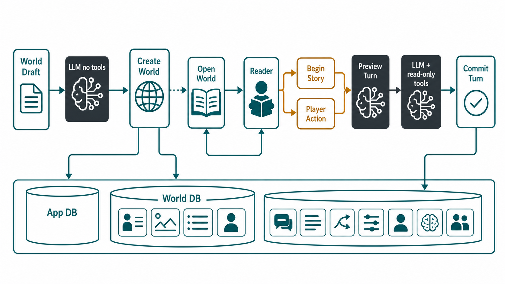
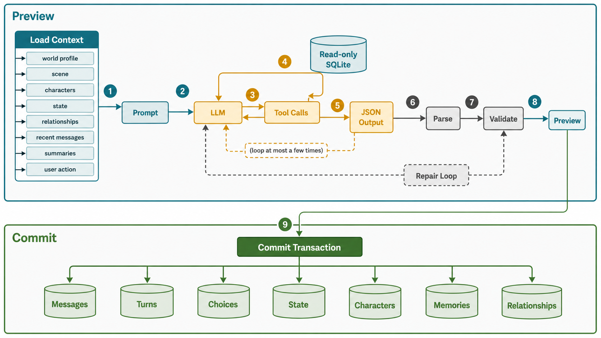

# Lingua Lore

[**English**](README.md) | [**中文**](README.zh.md)

---

Lingua Lore is a Tauri desktop app for immersive foreign-language interactive fiction. The runtime is built around local SQLite state, DeepSeek-compatible chat completions, structured JSON story turns, and a small read-only tool layer that lets the model look up durable world facts without writing to storage directly.

### Product Names

| Language | Name |
|---|---|
| English | Lingua Lore |
| Chinese (简体中文) | 语境传说 |
| Japanese (日本語) | 言の葉ロア |

## Runtime At A Glance



The app has two levels of storage:

- `app.db` stores the world library and API profiles.
- Each world has its own `world.db` under the app data directory. That database stores the world profile, scenes, characters, messages, turns, branch choices, story state, memories, and relationship state.

World draft generation, world creation, story preview, and story commit are separate operations. This separation matters: previewing a story turn can call the LLM and read tools, but it does not write the generated turn to the world database until the frontend sends the preview back to `commit_story_turn_preview`.

## World Generation And Initialization

The "AI fill" flow calls `generate_world_draft`. It loads the latest saved API profile, sends a schema-constrained chat completion request, and asks for a single `CreateWorldRequest` JSON object. This draft generator does not register tools. It retries model requests up to 4 times and can ask the model to repair invalid draft JSON.

The draft is only form data. A world is actually initialized when `create_world` persists the request:

- A new row is inserted into `app.db.worlds`.
- A dedicated world directory and `world.db` are created.
- The world database migration is applied.
- `world_profile` is seeded from the request.
- One opening scene is inserted with objective `Initialize the story`.
- `story_state.scene.current` points to that opening scene.
- Exactly one player character is required. The player character is stored as `char_player`.
- Any non-player seed characters, if present, start with `trust = 0`; the current UI normally submits only the player character.

Opening an existing world calls `get_world_bootstrap`. It loads the world record, finds `story_state.scene.current` or falls back to the first scene, and reconstructs prior turns from `turns`, `messages`, and `branch_choices`.

## Story Turn Runtime



The reader starts the first turn by sending the free-text action `Initialize the story with a vivid opening scene.` Later turns are either a selected branch choice or free text.

The normal path is:

1. Frontend calls `preview_story_turn`.
2. Rust loads context from `world.db`.
3. Rust builds a system message and a user message.
4. DeepSeek is called with JSON output enabled and read-only tools available.
5. If the model asks for tools, Rust executes the requested read-only SQLite queries and appends the tool results back into the message list.
6. When the model returns content, Rust parses it as `TurnOutput` and validates it.
7. If parsing or validation fails, Rust appends a repair instruction and retries the turn.
8. A valid preview is returned to the frontend without committing database writes.
9. Frontend calls `commit_story_turn_preview`.
10. Rust validates again and writes the turn in one SQLite transaction.

Runtime limits in code:

| Area | Limit |
|---|---:|
| Model request retries | 4 |
| Turn repair attempts | 4 |
| Tool rounds per preview | 3 |
| Total tool calls per preview | 8 |
| Recent messages loaded | 12 |
| Recent summaries loaded | 8 |
| Characters loaded into prompt | 12 |
| Story state rows loaded | 80 |
| Relationship rows loaded | 80 |

## Context, Tools, And Memory

`load_context` reads a compact snapshot:

- World profile: title, description, genre, target language, level, narrative style.
- Current scene: title, location, mood, current objective.
- Characters, with the player first.
- Story state key-values.
- Relationship state.
- Recent scene messages.
- Recent scene turn summaries.
- Current user action, resolved from either free text or the selected branch choice.

The model receives three optional read-only tools:

| Tool | What it reads |
|---|---|
| `query_character_profile` | One character profile by `character_id` |
| `query_character_memory` | Promoted memories for one character, matched with SQL `LIKE` |
| `query_past_events` | Prior turn summaries matched with SQL `LIKE` |

These tools are not agents and not write tools. They return JSON rows from SQLite. There is no vector database or embedding retrieval in the current code.

Memory is created during commit:

- The model emits `memory_candidates`.
- Rust records every candidate in `memory_candidates`.
- A candidate is promoted into `memories` only when `importance >= 7` and the referenced character already exists.
- Tool calls can later retrieve promoted memories through `query_character_memory`.

Relationship state is also committed from model output:

- Each relationship update must reference an existing character.
- Deltas are limited to `-2..2`.
- Stored relationship values are clamped to `-100..100`.
- Every applied update is logged in `relationship_update_logs`.

## Commit Semantics

`commit_turn` runs inside one SQLite transaction. It:

- Marks the selected prior branch choice as selected, when the input is a choice.
- Inserts the user message and assistant story message.
- Inserts the `turns` row with the raw model JSON.
- Updates the current scene status and summary.
- Inserts the next three branch choices and assigns stable choice IDs.
- Applies allowed story state updates and logs them.
- Inserts durable new NPCs if their names are not duplicates.
- Records memory candidates and promotes high-importance valid memories.
- Applies relationship deltas and logs them.

Validation happens before commit. A story turn must include non-empty narration, exactly three choices labeled `A`, `B`, `C`, valid risk levels, allowed story-state keys, memory importance from `1` to `10`, and relationship deltas from `-2` to `2`.

## Reader Behavior

Quick mode does not change the model, prompt, temperature, or validation rules. In the current frontend it prefetches previews for all available choice IDs after a turn. If the player selects a prefetched choice, the app commits that cached preview instead of waiting for a fresh generation. This feels faster, but it can spend more model calls because unused branches may be generated.

Selection translation is independent of the story runtime. Highlighted text is sent to the translation provider with nearby context, and the result is shown in a popover. It does not enter the story prompt or mutate world state.

## Stack

- Tauri + Rust backend
- React + Vite frontend
- SQLite storage
- DeepSeek Chat Completions with an OpenAI-compatible request shape
- Youdao public dictionary endpoint for independent selection translation

## Setup

```powershell
npm install
```

For Android builds, also install:

- Android Studio
- Android SDK Platform Tools
- Android SDK Build Tools
- Android SDK Platform, currently `android-36`
- Android NDK, currently `27.0.12077973`
- Rust Android targets:

```powershell
rustup target add aarch64-linux-android armv7-linux-androideabi i686-linux-android x86_64-linux-android
```

Recommended Android environment variables:

```powershell
$env:ANDROID_HOME="$env:LOCALAPPDATA\Android\Sdk"
$env:ANDROID_SDK_ROOT="$env:LOCALAPPDATA\Android\Sdk"
$env:NDK_HOME="$env:ANDROID_HOME\ndk\27.0.12077973"
```

## Development

```powershell
npm run dev
npm run typecheck
```

## Windows Build

Build the Windows app locally:

```powershell
npm --workspace @lingua-lore/desktop run tauri -- build
```

Useful outputs are written under:

```text
apps/desktop/src-tauri/target/release/bundle/
```

For a fast local compile check without packaging installers:

```powershell
npm --workspace @lingua-lore/desktop run tauri -- build --debug --no-bundle
```

## Android Build

Initialize the Tauri Android project once:

```powershell
npm --workspace @lingua-lore/desktop run tauri -- android init
```

Build a release APK locally:

```powershell
npm --workspace @lingua-lore/desktop run tauri -- android build --apk --target aarch64
```

The APK is written under:

```text
apps/desktop/src-tauri/gen/android/app/build/outputs/apk/universal/release/
```

## Local Release

Releases are published from local build artifacts. GitHub Actions remote builds are intentionally not used.

1. **Make code changes and bump versions**. Update all version files:

   | File | Field |
   |---|---|
   | `package.json` | `version` |
   | `apps/desktop/package.json` | `version` |
   | `apps/desktop/src-tauri/Cargo.toml` | `version` |
   | `apps/desktop/src-tauri/tauri.conf.json` | `version` |
   | `apps/desktop/src-tauri/gen/android/app/tauri.properties` | `versionName` + `versionCode` |

   > Android `tauri.properties` is auto-generated. Edit it directly before the Android build.

2. **Configure Android APK signing** once in `apps/desktop/src-tauri/gen/android/app/build.gradle.kts`.

3. **Run checks:**

   ```powershell
   npm run typecheck
   cargo check --manifest-path apps/desktop/src-tauri/Cargo.toml
   ```

4. **Commit everything**:

   ```powershell
   git add .
   git commit -m "feat: your feature description"
   git push origin main
   ```

5. **Build Windows and Android locally:**

   ```powershell
   npm --workspace @lingua-lore/desktop run tauri -- build
   npm --workspace @lingua-lore/desktop run tauri -- android build --apk --target aarch64
   ```

6. **Tag and publish from explicit local artifact paths.**
